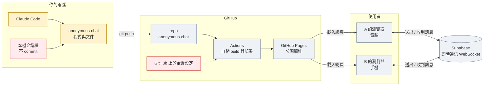
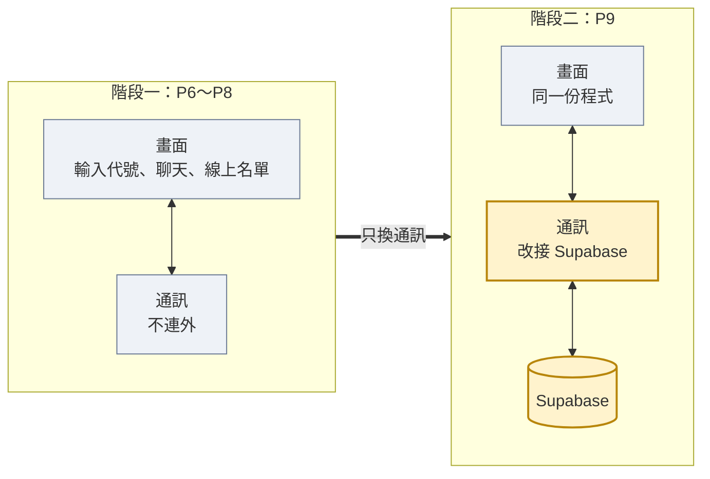
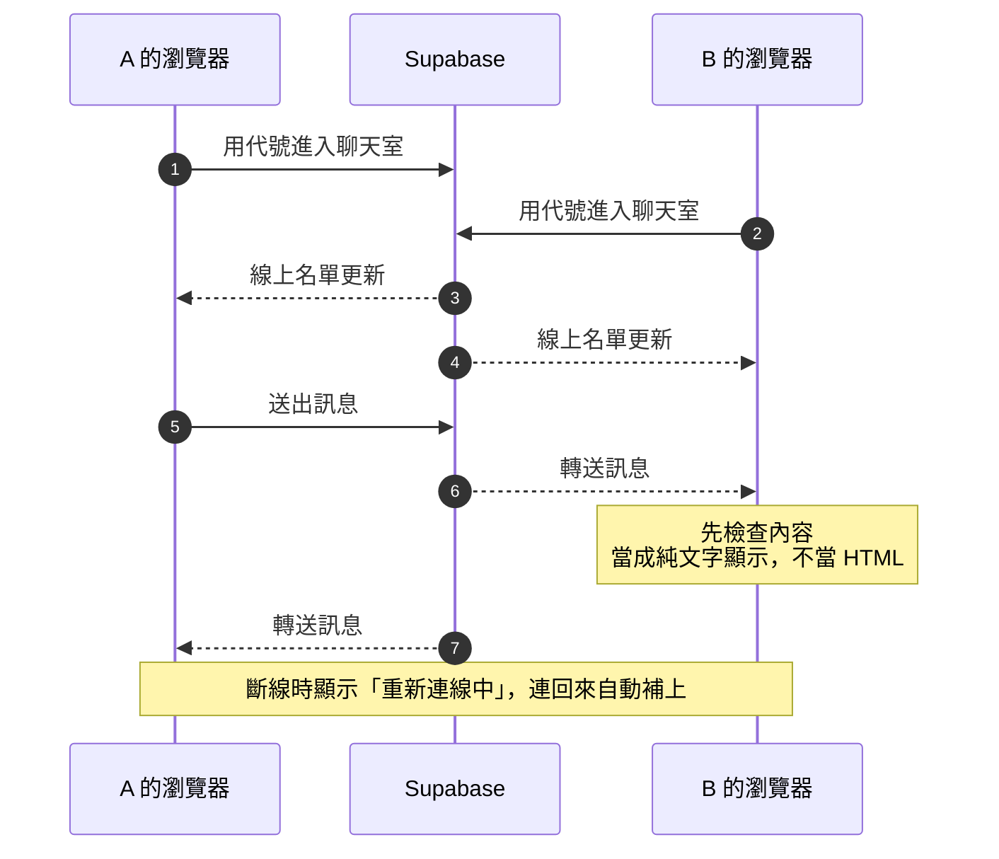
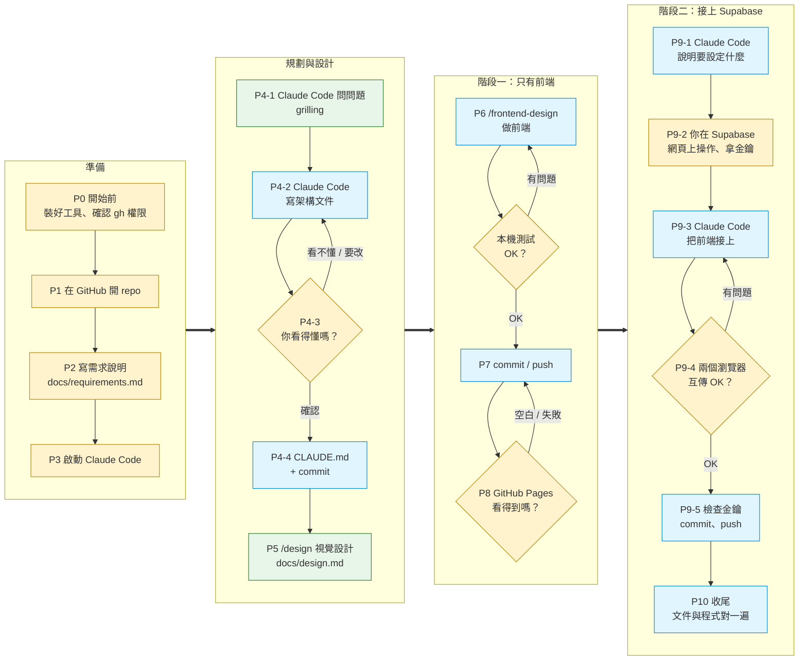
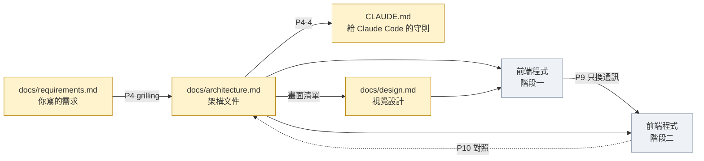

# 匿名聊天室：實作前導覽

這份 Project 流程從「你目前知道的東西」開始，讓 Claude Code 幫你補上你還不知道的部分。架構文件 `docs/architecture.md` 是流程中由你和 Claude Code 一起產出的，不是事先給你的。

這一頁只有圖，用來在動手前講解。實際操作的步驟在 [prompts/](prompts/README.md)，一步一個檔案。

## 1. 做完之後長什麼樣子

網頁放在 GitHub Pages，每個人用自己的瀏覽器打開。訊息不經過 GitHub，而是透過 Supabase 即時轉送給其他人。

紅色是金鑰。哪一把可以放在前端、哪一把絕對不能出現，由架構文件「金鑰」那一節決定。

## 2. 分兩個階段做

先做不連 Supabase 的版本，確定畫面和操作都對，再把「通訊」換成 Supabase。畫面的程式不用重寫。

## 3. 一則訊息怎麼從 A 到 B

這張圖對應 P4-3 檢查清單的第一題：「訊息從我的瀏覽器送出後，經過哪裡、怎麼到別人的瀏覽器？」

## 4. 整個步驟的流程

四個階段由左到右，每個階段裡由上往下。每一步做完才進下一步。黃色是你自己做，藍色是交給 Claude Code，綠色是你和 Claude Code 一起做。

## 5. 文件怎麼一路傳下去

每一步的產出都寫成檔案存在 repo 裡，下一步讓 Claude Code 去讀。換電腦、重開 Claude Code 都接得上。

## 開始動手

照 [prompts/README.md](prompts/README.md) 的順序從 P0 開始。
