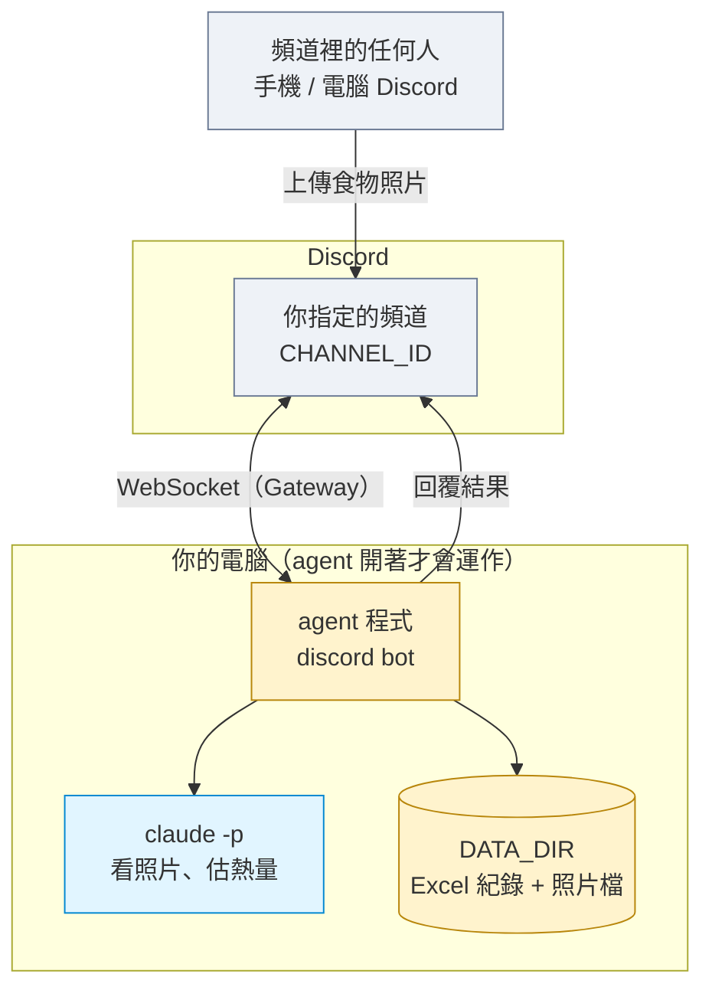
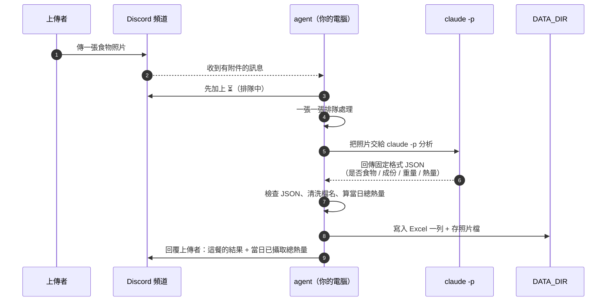
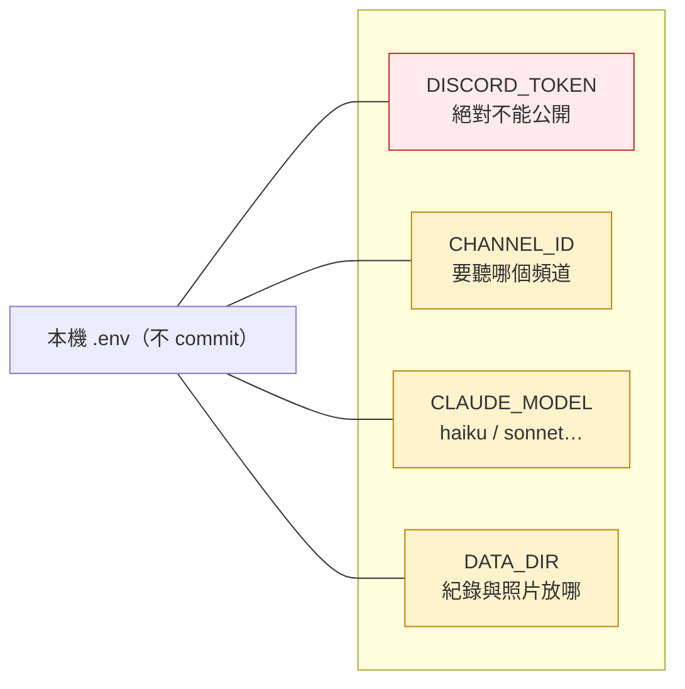
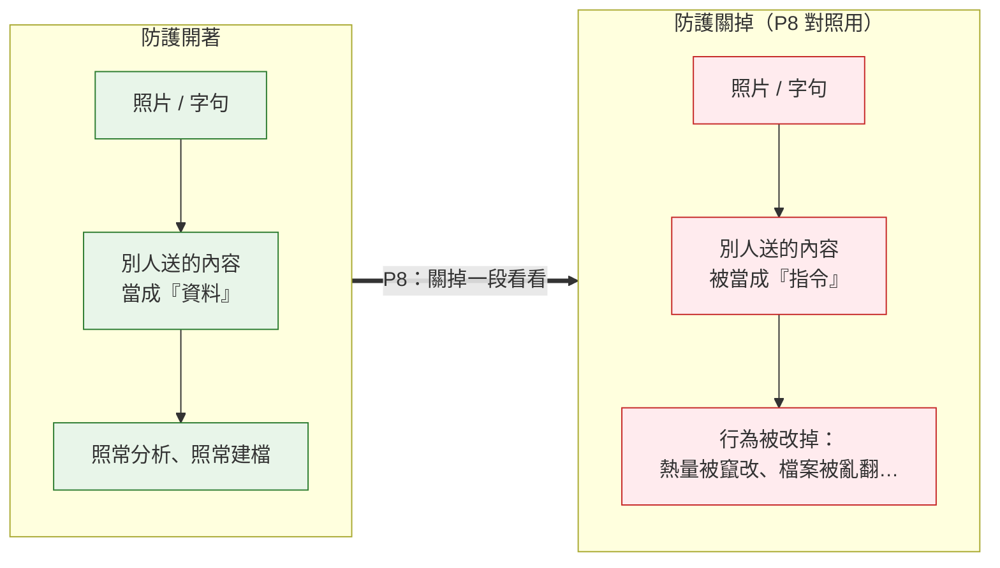

# 食物照片記錄 Agent：實作前導覽

這個 Project 做一個在你電腦上執行的 agent：只要它開著，Discord 頻道裡任何人傳一張食物照片進來，它就用 `claude -p` 判斷、估熱量、建檔，再回覆上傳者。

這一頁是動手前講解用的圖。實際操作的步驟在 [prompts/](prompts/README.md)，一步一個檔案。

和前一個 Project 不同的地方：

- 沒有 GitHub Pages、沒有前端網頁。成果是一支在**你自己電腦上跑**的程式，關掉就不處理。
- 要處理的照片經過 `claude -p`。agent 會把「使用者傳進來的東西」交給模型，這就帶出一個新主題：**別人傳進來的內容，可不可以當成指令？** 這是這個 Project 後半的重點。

## 1. 系統裡有哪些角色

- 每個人開自己的 Discord Server，把 agent 接到自己 Server 的一個頻道（`CHANNEL_ID`）。
- agent 用 Gateway 模式連 Discord（對外的 WebSocket，不需要 ngrok，也不用對外開埠）。
- 照片、Excel 紀錄都存在**你電腦上的 `DATA_DIR`**，不上傳到任何雲端。
- 每處理一張照片就花掉你自己的 Claude 額度。agent 一關，頻道裡再怎麼傳都不會有反應。

## 2. 一張照片怎麼被處理

- 好幾個人同時傳，照片會**排隊一張一張處理**，先加 ⏳ 讓上傳者知道收到了。
- 模型回來的東西 agent **不直接相信**：要先確認格式對、數字是數字，才寫檔、才回覆。
- 「當日已攝取熱量」是把當天這個頻道處理過的所有熱量加起來（這一版不分人；要分人是作業）。
- 如果判定**不是食物**，一樣建檔、一樣回覆，只是食物名稱那欄寫「不是食物」，成份欄寫它到底是什麼（例如「馬克杯」）。

## 3. 設定從哪裡來

- `DISCORD_TOKEN` 是你 Server 的 bot 金鑰，拿到別人手上就能冒用你的 bot，**不能貼進任何對話、不能 commit**。
- `CLAUDE_MODEL` 可以換，課堂後半會讓你拿不同 model 各打一次做對照。
- 這些都放 `.env`，`.env` 要在 `.gitignore` 裡。

## 4. 後半段在練什麼：別人傳的東西能不能當指令

照片和上傳者打的字，都是「別人送進來的內容」。agent 把這些交給 `claude -p` 的時候，如果程式寫得不好，別人就能用一張照片或一句話**改變 agent 的行為**——這叫 prompt injection。

這個 Project 的 agent 會把幾類防護**各自包成一段**、標好開始與結束。前半段先把防護全部做好、確認正常運作；後半段（P8）老師會帶你**一段一段關掉**防護，看 agent 被影響成什麼樣子，再打開。目的是讓你親眼看到：

> 安全不能靠「模型夠不夠聰明」，要靠程式有沒有把「別人送進來的資料」和「給模型的指令」分開。

這張圖只講「會差很多」，**怎麼差、怎麼打**留到 P8 由老師帶。

## 開始動手

從 [prompts/README.md](prompts/README.md) 的 P0 開始。
